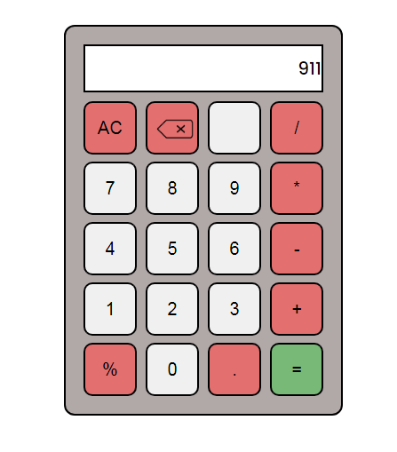

# Calculator
A browser based calculator built with javascript.

## Live Demo
🔗 https://lukman2458.github.io/calculator/

## Preview

## Feautures
- Can do arithmetic calculations
- No messing up on decimals or overflow numbers
## Built With
- Html
- Css(Flexbox and other props)
- JavaScript(DOM Manipulation,events,condtionals,flagging)
## What I Learned
- Dynamically creating and manipulating the DOM
- Using flags to control the condition logics
- All clear , backspace and no twice decimal buttons logic
- Working with css and flex properties
